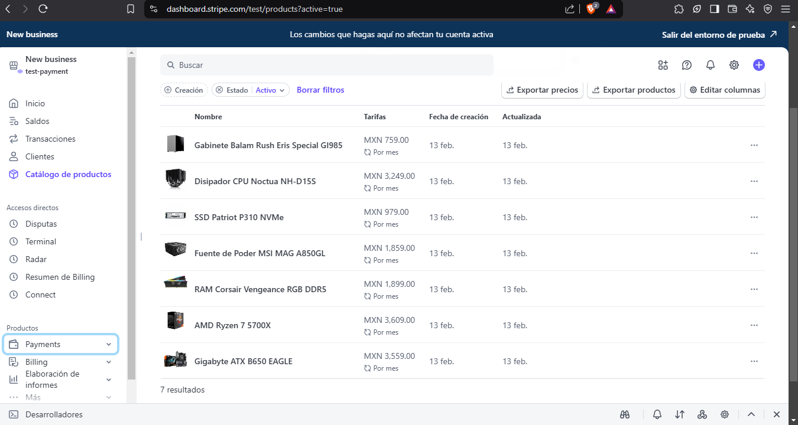
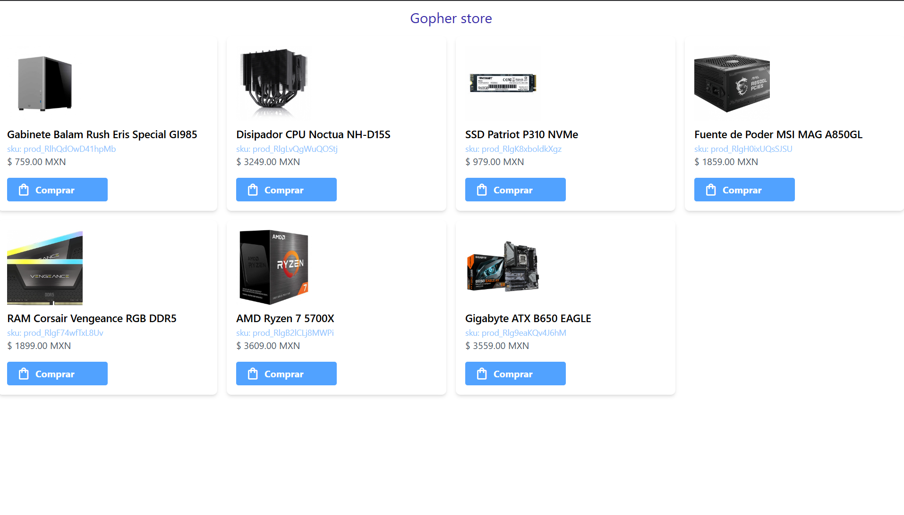
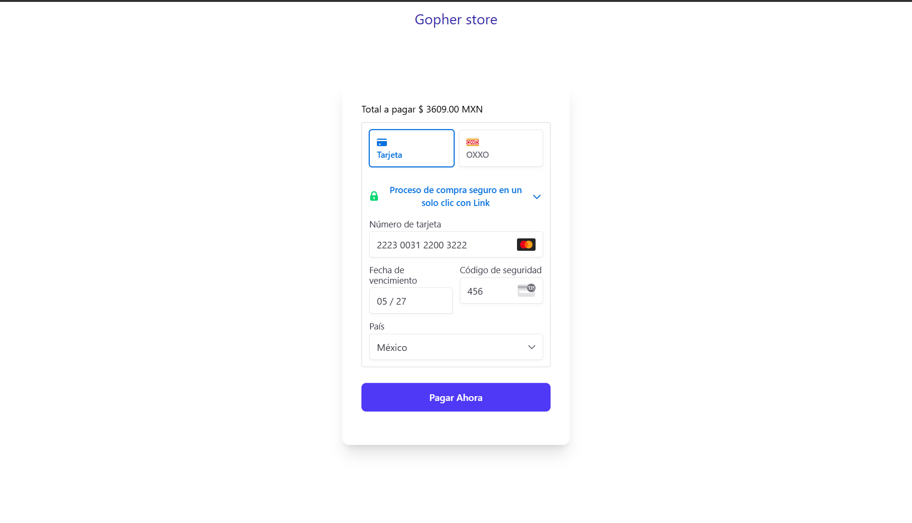
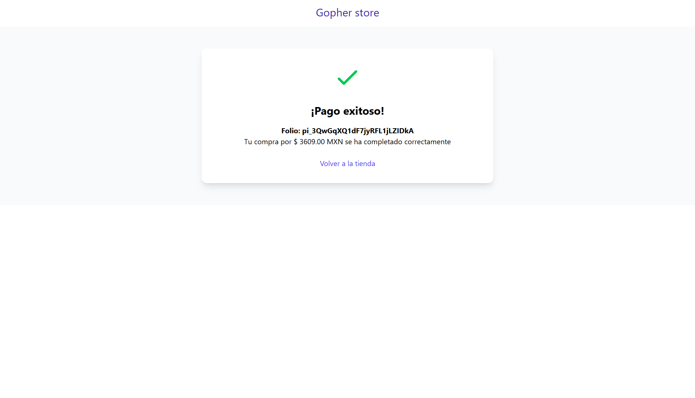

## Pasarela de pagos con stripe 

La pasarela de pago  usa un backend y un pequeño front end. el backend esta escrito en [go](https://go.dev/) usando [gin](https://gin-gonic.com/) para servir las diferentes rutas para mostrar templates y rutas requeridas para procesar pagos con stripe. los templates utilizan html y [htmx](https://htmx.org/) para tener una experiencia mas reactiva sin recurrir a frameworks mas complejos.

1.-Carga productos a stripe mediante el dashbord 



2.-Configura el archivo .env con las siguientes claves 
```bash
STRIPE_SECRET_KEY="YOUR_SECRET_KEY"
STRIPE_PUBLIC_KEY="YOUR_PUBLIC_KEY"
```
3.-Ejecutar archivo main.go 

```go 
go run main.go
```
3.-Usuarios de  docker puedes construir una imagen de la applicacion y ejecutarla en un contendor 
``` docker 
 docker build -t stripe-store .
 docker run -d --name stripe-demo -p 3000:3000 stripe-store:latest 

```
## Aplicación en funcionamiento 
- cargando productos de stripe 



- al dar click el boton pagar se carga el formulario pago usando stripe elements 



- confirmacion del pago




